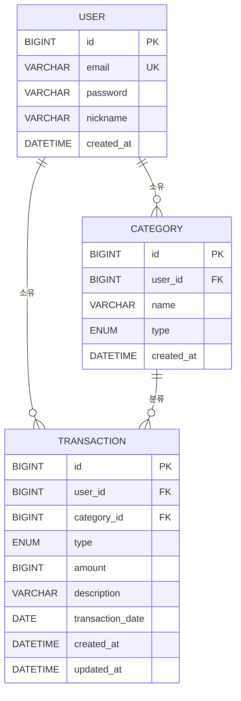

# 머니로그(MoneyLog) 도메인 모델 & ERD

## 1. 엔티티 개요

요구사항(docs/requirements.md)에서 도출한 엔티티는 3개입니다. (Budget은 이번 범위에서 제외 — F-11 Won't)

| 엔티티 | 설명 |
|--------|------|
| User | 로그인 주체, 모든 데이터의 소유자 |
| Category | 거래를 분류하는 카테고리 (사용자별 소유) |
| Transaction | 실제 수입/지출 기록 |

## 2. 엔티티 상세

### User
| 컬럼 | 타입 | 제약 | 설명 |
|------|------|------|------|
| id | BIGINT | PK, AUTO_INCREMENT | 사용자 식별자 |
| email | VARCHAR(255) | NOT NULL, UNIQUE | 로그인 ID |
| password | VARCHAR(255) | NOT NULL | BCrypt 해시 저장 |
| nickname | VARCHAR(50) | NOT NULL | 표시용 이름 |
| created_at | DATETIME | NOT NULL | 가입 시각 |

### Category
| 컬럼 | 타입 | 제약 | 설명 |
|------|------|------|------|
| id | BIGINT | PK, AUTO_INCREMENT | 카테고리 식별자 |
| user_id | BIGINT | FK → users.id, NOT NULL | 소유 사용자 |
| name | VARCHAR(50) | NOT NULL | 카테고리 이름 |
| type | ENUM('INCOME','EXPENSE') | NOT NULL | 수입/지출 구분 |
| created_at | DATETIME | NOT NULL | 생성 시각 |

가입 시 기본 카테고리 자동 시드: 지출(식비/교통/주거/문화), 수입(급여/용돈). 이후 사용자가 추가·수정·삭제 가능.

### Transaction
| 컬럼 | 타입 | 제약 | 설명 |
|------|------|------|------|
| id | BIGINT | PK, AUTO_INCREMENT | 거래 식별자 |
| user_id | BIGINT | FK → users.id, NOT NULL | 기록한 사용자 |
| category_id | BIGINT | FK → categories.id, NOT NULL | 분류 카테고리 |
| type | ENUM('INCOME','EXPENSE') | NOT NULL | 수입/지출 |
| amount | BIGINT | NOT NULL, > 0 | 금액(원 단위) |
| description | VARCHAR(255) | NULL 허용 | 메모/설명 |
| transaction_date | DATE | NOT NULL | 거래 발생일 |
| created_at | DATETIME | NOT NULL | 등록 시각 |
| updated_at | DATETIME | NOT NULL | 수정 시각 |

## 3. 관계

모두 1:N 관계이며 FK는 N쪽(자식) 테이블에 위치합니다.

| 관계 | 의미 |
|------|------|
| User 1:N Category | 한 사용자가 여러 카테고리를 가진다 |
| User 1:N Transaction | 한 사용자가 여러 거래를 가진다 |
| Category 1:N Transaction | 한 카테고리에 여러 거래가 속한다 |

Transaction은 user_id(인가: 본인 데이터 필터)와 category_id(카테고리별 통계·필터)를 모두 참조합니다. 모든 조회는 `WHERE ... AND user_id = :loginUserId` 형태로 인가를 강제합니다.

## 4. ERD (Mermaid)



## 5. 테이블 DDL (MySQL 8 기준)

```sql
-- 사용자
CREATE TABLE users (
    id BIGINT NOT NULL AUTO_INCREMENT,
    email VARCHAR(255) NOT NULL,
    password VARCHAR(255) NOT NULL,      -- BCrypt 해시
    nickname VARCHAR(50) NOT NULL,
    created_at DATETIME NOT NULL,
    PRIMARY KEY (id),
    UNIQUE KEY uk_users_email (email)
) ENGINE=InnoDB DEFAULT CHARSET=utf8mb4;

-- 카테고리 (User 1:N Category)
CREATE TABLE categories (
    id BIGINT NOT NULL AUTO_INCREMENT,
    user_id BIGINT NOT NULL,
    name VARCHAR(50) NOT NULL,
    type ENUM('INCOME','EXPENSE') NOT NULL,
    created_at DATETIME NOT NULL,
    PRIMARY KEY (id),
    CONSTRAINT fk_categories_user
        FOREIGN KEY (user_id) REFERENCES users(id)
) ENGINE=InnoDB DEFAULT CHARSET=utf8mb4;

-- 거래내역 (User 1:N Transaction, Category 1:N Transaction)
CREATE TABLE transactions (
    id BIGINT NOT NULL AUTO_INCREMENT,
    user_id BIGINT NOT NULL,
    category_id BIGINT NOT NULL,
    type ENUM('INCOME','EXPENSE') NOT NULL,
    amount BIGINT NOT NULL,              -- 원 단위 long, 항상 > 0
    description VARCHAR(255) NULL,
    transaction_date DATE NOT NULL,
    created_at DATETIME NOT NULL,
    updated_at DATETIME NOT NULL,
    PRIMARY KEY (id),
    CONSTRAINT fk_transactions_user
        FOREIGN KEY (user_id) REFERENCES users(id),
    CONSTRAINT fk_transactions_category
        FOREIGN KEY (category_id) REFERENCES categories(id)
        ON DELETE RESTRICT,              -- 카테고리 삭제 정책: 사용 중이면 삭제 차단
    KEY idx_tx_user_date (user_id, transaction_date)
) ENGINE=InnoDB DEFAULT CHARSET=utf8mb4;
```

## 6. 설계 결정 사항 및 근거

| 고민 | 결정 | 근거 |
|------|------|------|
| 금액 타입 | `long`(BIGINT), 원 단위 정수 | 원화는 소수점 없음. double은 부동소수 오차, BigDecimal은 이 규모엔 과함 |
| 날짜 타입 | transaction_date는 `LocalDate`(DATE), created/updated는 `LocalDateTime`(DATETIME) | 거래는 "며칠에 썼나"만 중요(시:분 불필요), 이력은 시각까지 필요 |
| ENUM 저장 방식 | `@Enumerated(EnumType.STRING)` | ORDINAL(기본값)은 순서 변경 시 데이터가 뒤섞이는 함정이 있음 |
| 삭제 정책 | hard delete + 카테고리는 **삭제 막기**(RESTRICT) | 개인 가계부라 삭제 이력 추적 요구는 없음. 단, 카테고리는 거래가 참조 중이면 FK 제약으로 삭제 자체를 차단해 데이터 유실을 방지. 구현 난이도 대비 가장 안전한 선택 |

## 7. 체크리스트
- [x] 요구사항에서 엔티티 3개(User/Category/Transaction) 도출 (Budget은 범위 제외)
- [x] 각 엔티티 컬럼·타입·제약 정리 (필드명 SPEC과 일치)
- [x] 1:N 관계 3개 정의, FK 위치(N쪽) 확인
- [x] Transaction이 user_id + category_id를 모두 갖는 이유 설명 가능
- [x] ERD(Mermaid) 작성
- [x] users/categories/transactions CREATE TABLE 작성
- [x] 금액/날짜 타입, ENUM 저장 방식, 삭제 정책 결정 및 근거 기록
